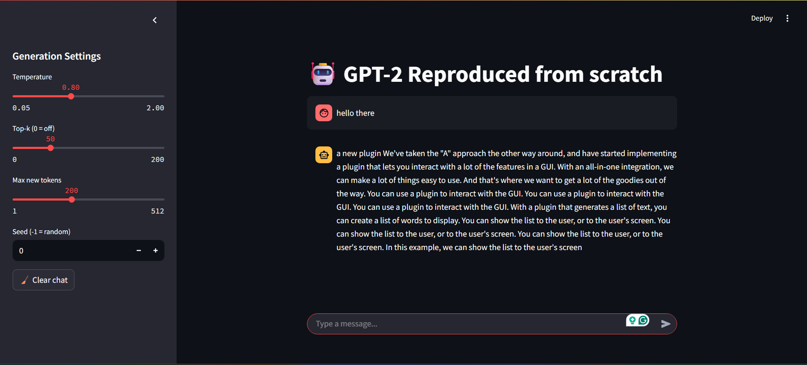

# GPT-2 Foundational Model Coded From Scratch Using PyTorch

A from-scratch PyTorch implementation of the GPT-2 architecture, including a toy training loop, HuggingFace distilgpt2 (82M) pretrained weight loading, autoregressive text generation, and a Streamlit UI demo.

Streamlit demo: https://gpt-built-from-scratch-gg43jqmryyynvfbn9fz7ve.streamlit.app/

## What this project does

In this project, I have:

1) Reproduced the entire GPT-2 architecture from scratch with just PyTorch,
2) Wrote the training loop and trained the model on a small toy dataset (for demonstration purposes only),
3) Loaded pre-trained weights from the 82 million parameter HuggingFace distilgpt2 model onto an instance of my GPT-2 architecture,
4) Wrote the code to autoregressively generate text from the model, and
5) Visualized the results on a frontend streamlit app.

## Brief Description of the GPT2 Architecture

### Some Important Model Hyperparameters

* T = Context Length
* M = Model Dimension

These terms will be explained in subsequent sections.

### Structure of Data

Example datapoint:

```python
example_sentence = "The book is on the table"
T = 5 # context length
X = ["The","book","is","on","the"] # input
Y = ["book","is","on","the","table"] # output
```

In data preprocessing, we convert text into input and output pairs of context lists of length T as shown above. Observe that the output is obtained by shifting the context window of the input by 1.

### Tokenization

The tokenizer maps the individual tokens in the X's and Y's into their associated integers based on its mapping. There are various tokenizers, some of which are word-based, some characer-based, some subword-based, etc. The way text is broken and mapped into tokens has a huge impact on the model's performance. The overall set of tokens and their mappings is called vocabulary.

### Vector Embeddings

Each token in the X's and Y's are then represented as with two M-dimensional vectors with trainable weights, one encoding the unique similarity-vector representation of the token itself, and the other encoding the position of the token within X (and Y) in relatin to other tokens.

### Self Attention Mechanism

For the input X (which is a 1 ✕ T ✕ M matrix), we define three (1 ✕ T ✕ M) matrices which are basically parallel independent trainable linear dimension-preserving neural network layers with X as the input. These three parallel layers are:

* Key (K): A layer which learns the meaning of the token's position in the given context,
* Query (Q): A layer which learns which other token it relates the most to in the given context, and
* Value (V): A layer which learns the importance of the token in the given context.

These three components constitute the attention mechanism. They are then combined using the below formula:

$$\mathrm{softmax}\left(\frac{QK^{\top}}{\sqrt{M}}\right)V$$

This output is a 1 ✕ T ✕ M matrix which is fed into subsequent layers.

In case of GPTs, to prevent the model from learning right-left relationships (i.e. seeing the future a.k.a look-ahead bias), we add a pre-mask L (which is a T ✕ T lower-triangular matrix) that masks the tokens that are ahead of the intended output in the context. So therefore, for GPT's, the formula becomes:

$$L \bigg[\mathrm{softmax}\left(\frac{QK^{\top}}{\sqrt{M}}\right)\bigg]V$$

### Multi Headed Attention

This is nothing but $k$ self-attention layers of dimension 1 ✕ T ✕ M/$k$ executed in parallel, concatenated, and then again run through a dimension-preserving neural network layer.

### Transformer Block

A transformer block consists of a multi-head attention block and a feed forward layer with GELU activation, with layer normalization performed prior to each layer and input added to the output after each layer.

### GPT

The GPT block consists of a tokenizer, a vector and a position embedding through which the input X is passed. Then the outputs of the token and position embeddings are added up and the combined output is passed through a sequential series of $N_x$ transformer layers, followed by a layer normalization. This normalized output is then passed through a linear layer with output dimension equal to vocabulary size. This is then softmaxed to get the probabilities for predicting the next token in the text sequence.

## Demo



What you can do in the demo:

* Choose sampling parameters (temperature, top_k, max_new_tokens)
* Enter a prompt
* Generate text using distilgpt2 pretrained weights loaded into this implementation

## Quickstart

### 1) Install

```bash
pip install -r requirements.txt
```

### 2) Run the Streamlit app

```bash
streamlit run frontend/app.py
```

### 3) Generate text (CLI / script)

```bash
python src/Generator.py

# Tweak the prompt, temperature, top_k, max_new_tokens, etc. in Generator.py
```

### 4) Train a toy model (demo)

```bash
python src/run_train.py

# To play witnh hyperparameters, tweak the arguments in the model declaration (line 34) and the calling of the train_gpt() function (line 44) in src/run_train.py
```
### 4) Load a pre-trained model

```bash
python src/load_pretrained_model.py
```

## Usage

### Streamlit UI

* Entry point: `frontend/app.py`
* Shows: prompt input, sampling controls, generated outputs

### Autoregressive generation

* Entry point: `src/Generator.py`
* Supports:

  * temperature sampling
  * top_k filtering
  * reproducible generation via seed

### Training (toy)

* Entry point: `src/run_train.py` + `src/Training_Loop.py`
* Dataset: `train.txt` (demo-scale)
* Outputs:

  * `model.pkl` (toy-trained checkpoint)
  * (optional) logs, loss curve, etc.

## Loading distilgpt2 pretrained weights

This repo can load HuggingFace **distilgpt2** weights into the from-scratch GPT-2 implementation.

* Loader: `src/load_pretrained_model.py`
* Expected behavior:

  * Logits should closely match HuggingFace for the same prompt (within small numerical tolerance)
  * Argmax tokens should match for sanity-check prompts
  * max_abs_diff close to zero and hf_argmax == my_argmax indicates that our architecture coded from scratch exactly matches the distilgpt2 architecture.

> Sanity check test results:
>
> * max_abs_diff: 3.814697265625e-05
> * hf_argmax: 13
> * my_argmax: 13

## Project structure

```text
frontend/
  app.py                        # Streamlit UI

src/
  GPT.py                        # GPT-2 model definition (embeddings, multiple transformer blocks, final head)
  Transformer_Block.py          # Transformer block (pre-norm, residuals)
  Multi_Headed_Attention.py
  Self_Attention_Mechanism.py
  Data_Preprocessing.py         # tokenization / batching windows
  Training_Loop.py              # training loop utilities
  run_train.py                  # training entry point
  Generator.py                  # autoregressive generation
  load_pretrained_model.py      # distilgpt2 weight loader

config.yaml                     # hyperparameters + encoding config
train.txt                       # toy dataset
model.pkl                       # toy-trained checkpoint (demo)
pre_trained_model.pkl           # checkpoint after loading distilgpt2 weights
requirements.txt
LICENSE
```

## Notes / Limitations

* The toy-trained model is trained on a small dataset for demonstration, so coherence may be limited.

* Sampling parameters (temperature/top_k) strongly affect output quality.

* This is an early foundational model with very low parameter count compared to later models, and it isn't finetuned, so it will produce repetitive/incoherent text and will not function as a conversational model. This project is just a demonstration of my understanding of core foundational LLM skills. This repo is intended as an educational + engineering reproduction, not an optimized production inference stack.

## Acknowledgments

* Radford, Alec, Jeffrey Wu, Rewon Child, David Luan, Dario Amodei, and Ilya Sutskever. "Language models are unsupervised multitask learners." OpenAI blog 1, no. 8 (2019): 9.
* "Build a Large Language Model (From Scratch)" by Sebastian Raschka
* HuggingFace Transformers (distilgpt2) (https://huggingface.co/distilbert/distilgpt2)
* tiktoken (https://github.com/openai/tiktoken)
* Streamlit

## License

See `LICENSE`.
