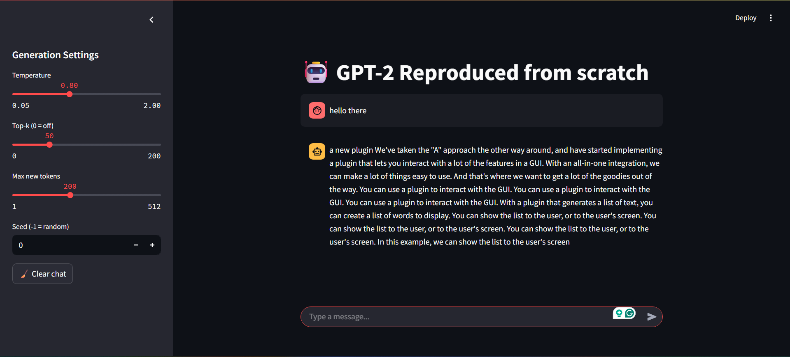

# GPT-2-Style Decoder-Only Transformer Implemented Manually in PyTorch

This repository is an educational, engineering-focused reimplementation of a GPT-2-style decoder-only transformer in PyTorch. It includes a manually built transformer architecture, scratch training on local text, autoregressive text generation, a weight-loading path for Hugging Face `distilgpt2`, and a lightweight Streamlit demo UI.

The goal of the project is not to present a production LLM platform. The point is to demonstrate real understanding of transformer internals, tensor flow, causal masking, training mechanics, and pretrained weight layouts by rebuilding the architecture and validating it against a real Hugging Face model.

Streamlit demo: https://gpt-built-from-scratch-gg43jqmryyynvfbn9fz7ve.streamlit.app/

## Why This Project Exists

Many repos show how to call a pretrained language model. This one is about understanding what sits underneath that API boundary.

This project exists to demonstrate:

- how a decoder-only transformer works internally
- how GPT-style next-token prediction is set up from raw text
- how autoregressive sampling is implemented token by token
- how pretrained weights can be mapped from one model implementation into another when the parameter layouts differ

In other words, this is a reconstruction project: a compact but technically serious attempt to rebuild the core GPT-2 mechanics in raw PyTorch rather than treat the model as a black box.

## Key Features

- Manual GPT-2-style decoder-only transformer implementation in PyTorch
- Token embeddings plus positional embeddings, followed by stacked transformer blocks
- Pre-layernorm transformer block design with residual connections
- Multi-head causal self-attention with separate per-head query, key, and value projections
- Feed-forward network expanding `D -> 4D -> D` with GELU and dropout
- Scratch training on a local text corpus using next-token prediction
- Autoregressive generation with temperature, optional top-k filtering, and optional random seed control
- DistilGPT2 weight import into the custom architecture, including attention weight remapping
- Sanity-check validation of custom-model logits against Hugging Face `distilgpt2`
- Streamlit demo UI for interactive prompt-based generation

## Architecture Overview

The model is split across:

- `src/GPT.py`
- `src/Transformer_Block.py`
- `src/Multi_Headed_Attention.py`
- `src/Self_Attention_Mechanism.py`

At a high level, the architecture is:

1. Tokenize input text into GPT-2 token IDs.
2. Convert token IDs into token embeddings.
3. Add learned positional embeddings.
4. Pass the resulting sequence through a stack of decoder-only transformer blocks.
5. Apply a final layer normalization.
6. Project each position to vocabulary logits with a linear layer.

This is a proper transformer implementation, not a toy approximation. The model outputs raw logits over the vocabulary; probabilities are only produced later during training loss computation or sampling.

### Core Components

**Embeddings**

- `GPT.py` defines a learned token embedding table and a learned positional embedding table.
- The model sums token embeddings and position embeddings before sending them into the transformer stack.

**Transformer Blocks**

- `Transformer_Block.py` implements a pre-layernorm block.
- Each block applies:
  - layer norm
  - multi-head self-attention
  - residual addition
  - second layer norm
  - feed-forward network
  - second residual addition

**Self-Attention**

- `Self_Attention_Mechanism.py` implements a single causal self-attention head manually.
- Each head has separate learned `query`, `key`, and `value` projections.
- Attention scores are scaled by `sqrt(d)`.
- A lower-triangular causal mask prevents the model from attending to future tokens.

**Multi-Head Attention**

- `Multi_Headed_Attention.py` creates multiple independent attention heads.
- Their outputs are concatenated and projected back to the model width.

**Feed-Forward Network**

- The feed-forward block expands the hidden dimension from `D` to `4D`, applies GELU, projects back to `D`, and applies dropout.

## How the Model Works

### 1. Tokenization and training examples

`src/Data_Preprocessing.py` uses `tiktoken` with the vocabulary specified in `config.yaml`. In the current repo, `config.yaml` selects the GPT-2 tokenizer vocabulary:

```yaml
vocab: "gpt2"
```

Raw text is converted into token IDs, then sliced into next-token prediction windows. For a context window of length `T`, the model is trained on:

- input tokens: positions `0 .. T-1`
- target tokens: positions `1 .. T`

This is the standard shifted next-token prediction setup used by decoder-only language models.

### 2. Forward pass

Given a batch of token IDs with shape `(B, T)`:

- token embeddings produce `(B, T, D)`
- positional embeddings produce `(1, T, D)`
- the two are added
- the sequence is passed through the stacked transformer blocks
- a final layer norm is applied
- a linear layer projects each position to vocabulary logits `(B, T, V)`

The model does not apply softmax internally. That is left to:

- cross-entropy loss during training
- multinomial sampling during generation

### 3. Causal attention flow

Inside each self-attention head:

- `Q`, `K`, and `V` are computed from the embedded sequence
- attention scores are formed with `QK^T / sqrt(d)`
- a lower-triangular mask blocks look-ahead
- softmax converts masked scores into attention weights
- the attention weights are multiplied by `V`

That causal masking step is what makes the architecture decoder-only and suitable for autoregressive generation.

## DistilGPT2 Weight Loading and Validation

The most technically interesting part of the repository is `src/load_pretrained_model.py`.

This script shows that the project is not only "a transformer written from scratch," but also "a custom transformer implementation whose parameter layout is understood well enough to host real pretrained weights."

### What the script does

It instantiates a DistilGPT2-shaped version of the custom model with:

- `vocab_size = 50257`
- `context_length = 1024`
- `model_dim = 768`
- `num_blocks = 6`
- `num_heads = 12`

It then downloads Hugging Face `distilgpt2` and copies its weights into the custom architecture.

### What gets transferred

The script maps:

- token embeddings
- positional embeddings
- layer normalization weights and biases
- attention output projections
- MLP up-projection and down-projection weights
- final layer norm
- language-model head weights

### Why the attention mapping matters

The hardest part is attention weight transfer.

In Hugging Face `distilgpt2`, the attention input projections are stored in fused form. In this repository, each head has separate `query`, `key`, and `value` linear layers. The loader:

- reads the fused Hugging Face attention projection weights
- splits them into `Q`, `K`, and `V`
- slices them per head
- transposes them into `nn.Linear` layout where needed
- copies them into the custom per-head attention modules

The script also handles Hugging Face's Conv1D-style weight layout by transposing weights into the standard PyTorch linear-layer layout expected by this implementation.

### How correctness is checked

After loading weights, the script runs both models on the same prompt and prints:

- maximum absolute logit difference
- the final-position argmax token from Hugging Face
- the final-position argmax token from the custom model

This is a sanity check for behavioral and logit similarity. It is not a benchmark suite, but it is a strong architectural validation signal: the custom implementation is close enough to host real pretrained DistilGPT2 weights and produce matching next-token behavior on the test prompt.

The script writes the resulting custom checkpoint to `pre_trained_model.pkl`.

## Training Pipeline

The scratch-training path is implemented in:

- `src/Data_Preprocessing.py`
- `src/Training_Loop.py`
- `src/run_train.py`

### Training flow

1. Read `train.txt` as a local demonstration corpus.
2. Tokenize the full corpus once with `tiktoken`.
3. Build sliding windows using `unfold`.
4. Shuffle training windows each epoch.
5. Train with `AdamW`.
6. Clip gradients to stabilize optimization.
7. Use automatic mixed precision on CUDA when available.

`src/run_train.py` builds a smaller custom model than DistilGPT2 for demonstration-oriented scratch training:

- `context_length = 256`
- `model_dim = 512`
- `num_blocks = 12`
- `num_heads = 8`

Running the training script saves:

- `gpt_weights.pt` as a PyTorch state dict
- `model.pkl` as a pickled model object

This training path is intended to demonstrate next-token language-model training mechanics on local text, not to produce a polished conversational model.

## Text Generation Pipeline

`src/Generator.py` is the standalone generation script for a scratch-trained checkpoint.

Generation is autoregressive and token-by-token:

- encode the prompt with the GPT-2 tokenizer
- crop the current context to the model's context length
- run the model to get logits for the next position
- apply temperature scaling
- optionally apply top-k filtering
- sample the next token from the resulting probability distribution
- append the sampled token and repeat

The script expects `model.pkl` to already exist, so it depends on a previous run of `src/run_train.py` or an equivalent checkpoint being present.

The current script is a minimal example rather than a full CLI tool: prompt and sampling settings are defined directly inside the file.

## Streamlit Demo

The repo includes a lightweight Streamlit interface in `frontend/app.py`.

This UI is intentionally simple and should be described carefully:

- it is a chat-style wrapper around a raw language model
- it is not a chat-tuned assistant
- it is not an instruction-tuned assistant
- it does not turn the model into a production chatbot

The app keeps a running list of messages, formats them as plain text like:

```text
User: ...
Assistant: ...
```

then appends a trailing `Assistant:` and asks the language model to continue that sequence.

In other words, the interface looks conversational, but the underlying model is still just continuing text.

The app loads `pre_trained_model.pkl`, so the pretrained loading script must be run before launching the UI.



## Project Structure

```text
frontend/
  app.py                      # Streamlit UI for prompt-based generation

src/
  GPT.py                      # Decoder-only transformer definition
  Transformer_Block.py        # Pre-layernorm transformer block
  Multi_Headed_Attention.py   # Multi-head attention wrapper
  Self_Attention_Mechanism.py # Single causal attention head
  Data_Preprocessing.py       # Tokenization and training-window helpers
  Training_Loop.py            # Scratch training loop
  run_train.py                # Scratch training entry point
  Generator.py                # Standalone autoregressive generation script
  load_pretrained_model.py    # DistilGPT2 weight transfer and validation

config.yaml                   # Tokenizer vocabulary selection
train.txt                     # Local demo corpus for scratch training
requirements.txt              # Core Python dependencies currently listed
image.png                     # Streamlit demo screenshot
```

## Setup / Installation

Install the dependencies currently listed in the repository:

```bash
pip install -r requirements.txt
```

Important note: the codebase also imports `streamlit` and `yaml`, but `requirements.txt` currently lists only:

- `torch`
- `transformers`
- `torchtyping`
- `tiktoken`

So depending on your environment, you may also need to install:

- `streamlit`
- `PyYAML`

CUDA is optional. The code falls back to CPU when CUDA is unavailable, but training and pretrained comparison are much faster with a GPU.

## How To Run

### 1. Scratch training

```bash
python src/run_train.py
```

What this does:

- reads `train.txt`
- builds the smaller custom GPT model
- trains it with next-token prediction
- writes `gpt_weights.pt`
- writes `model.pkl`

### 2. Standalone generation from the scratch-trained model

```bash
python src/Generator.py
```

What this expects:

- `model.pkl` must already exist

What this does:

- loads the saved scratch-trained model
- tokenizes the prompt
- samples tokens autoregressively
- prints generated text

Note: `src/Generator.py` is currently a minimal example script, so the prompt and sampling parameters are defined inside the file rather than passed as CLI arguments.

### 3. Load Hugging Face DistilGPT2 weights into the custom architecture

```bash
python src/load_pretrained_model.py
```

What this does:

- constructs a DistilGPT2-shaped instance of the custom model
- downloads Hugging Face `distilgpt2`
- transfers weights into the custom implementation
- compares logits / argmax outputs on a sanity-check prompt
- writes `pre_trained_model.pkl`

Note: this path requires internet access on first run so the Hugging Face model can be downloaded.

### 4. Launch the Streamlit demo

```bash
streamlit run frontend/app.py
```

What this expects:

- `pre_trained_model.pkl` must already exist

What this does:

- loads the pretrained-transferred custom model
- exposes generation controls such as temperature, top-k, max tokens, and seed
- provides a chat-style interface for text continuation

## Example Workflows

### Workflow A: scratch architecture plus local training

1. Install the project dependencies.
2. Run `python src/run_train.py` to train a small custom checkpoint on `train.txt`.
3. Run `python src/Generator.py` to sample text from the saved `model.pkl`.

### Workflow B: pretrained architecture validation plus UI demo

1. Install the project dependencies.
2. Run `python src/load_pretrained_model.py` to import Hugging Face `distilgpt2` into the custom architecture and write `pre_trained_model.pkl`.
3. Run `streamlit run frontend/app.py` to interact with the pretrained-loaded custom model through the Streamlit interface.

## Limitations and What This Project Is Not

This repository is intentionally narrow in scope. It is not:

- a production inference or serving platform
- a modern instruction-following assistant
- a scalable distributed pretraining system
- a tokenizer-training project
- an API backend
- a benchmark-heavy research repo

It is also important not to overclaim the output quality:

- the local scratch-training path uses a demo-scale text corpus
- the scratch-trained model is not expected to behave like a polished assistant
- the Streamlit UI is a text-continuation wrapper, not a chat-tuned conversational system
- pretrained-weight validation is a sanity check for architectural fidelity, not a comprehensive equivalence proof

## Possible Future Improvements

- Add tighter dependency pinning and environment documentation
- Add more systematic validation tests for pretrained weight transfer
- Clean up checkpoint loading so model artifacts are more standardized
- Centralize model-size and path configuration beyond the current tokenizer setting
- Add optional visualizations for attention patterns or training loss

## Tech Stack

- PyTorch
- Hugging Face Transformers
- `tiktoken`
- TorchTyping
- Streamlit
- YAML configuration

## Closing Summary

This project is best understood as a hands-on decoder-only transformer reconstruction exercise. It shows the full path from raw architecture implementation, to local next-token training, to token-by-token sampling, to pretrained weight translation from Hugging Face into a custom model definition.

For portfolio and interview review, the strongest signal here is not just that a transformer was written in PyTorch, but that the implementation is faithful enough to host real DistilGPT2 weights and validate its behavior against the reference model. That is the kind of work that demonstrates genuine understanding of how language models are built under the hood.
