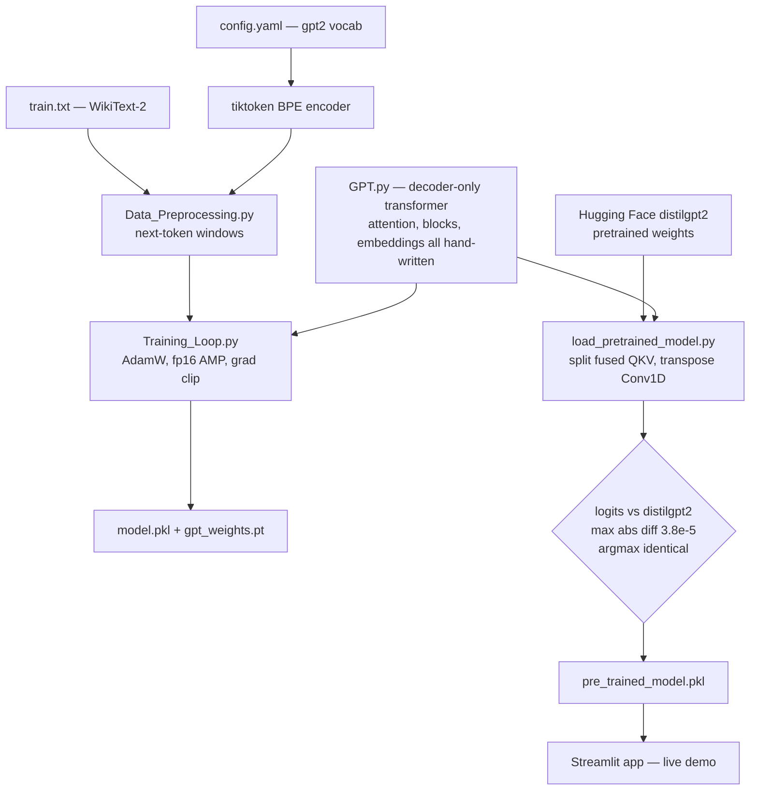
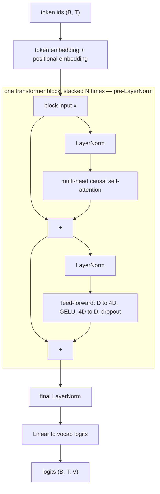

# GPT-2 from scratch in PyTorch

> A decoder-only transformer built by hand — manual causal attention, multi-head, pre-LayerNorm blocks, the training loop and the sampler — with no `nn.Transformer` and no model-building shortcuts.

<p align="center">
  
  
  
  
  
  
  
</p>

<p align="center">
  <a href="https://gpt-built-from-scratch-gg43jqmryyynvfbn9fz7ve.streamlit.app/"><b>Live demo</b></a> ·
  <a href="#how-it-works">How it works</a> ·
  <a href="#running-it">Run it</a>
</p>

Most LLM projects call a model through an API. This one rebuilds the thing under the API: a GPT-2-style decoder-only transformer written from first principles in PyTorch. The test of whether the re-implementation is actually *correct* — not just "looks like a transformer" — is that it loads Hugging Face's pretrained `distilgpt2` weights into the hand-written modules and reproduces the reference model's output: a maximum absolute logit difference of **3.8e-5** on a test prompt, with the **identical** next-token prediction. That number is the point of the repo. It only comes out that small if every tensor in the custom architecture lines up with the real model, parameter for parameter.


<p align="center"><sub>The deployed demo, serving the custom model after the DistilGPT2 weights are loaded into it.</sub></p>

## Why I built it

I built this to understand the nuts and bolts of how LLMs work, not just how to call one. Knowing what happens beneath the API makes me a more effective AI engineer day to day, and it's the same understanding that research is built on. I worked mostly from first principles, with Sebastian Raschka's *Build a Large Language Model (From Scratch)* as a reference when I got stuck.

The two parts that taught me the most were the two hardest: getting training to actually run on a 6 GB laptop GPU, and loading pretrained weights by hand. The second one is unforgiving — it forces you to know exactly which parameter in your architecture corresponds to which tensor in someone else's, or the logits simply don't match.

## What this demonstrates

| Skill for an AI/ML engineer role | Where it shows up in this repo |
|---|---|
| Transformer internals from first principles | Scaled dot-product attention with a causal mask ([Self_Attention_Mechanism.py](src/Self_Attention_Mechanism.py)), multi-head wrapper ([Multi_Headed_Attention.py](src/Multi_Headed_Attention.py)), pre-LN block with residuals ([Transformer_Block.py](src/Transformer_Block.py)), full model ([GPT.py](src/GPT.py)) |
| Checkpoint and weight-layout fluency | [load_pretrained_model.py](src/load_pretrained_model.py) splits Hugging Face's fused QKV projection and transposes its Conv1D weights into per-head `nn.Linear`s, then proves the port numerically |
| Training engineering under a memory budget | [Training_Loop.py](src/Training_Loop.py): fp16 autocast + `GradScaler`, fused `AdamW`, a GPU-resident `unfold` data path, gradient-norm clipping — on a 6 GB RTX 2060 |
| Inference and sampling | Temperature, top-k filtering, context cropping and autoregressive decoding ([Generator.py](src/Generator.py), [frontend/app.py](frontend/app.py)) |
| Shipping a working demo | A deployed Streamlit app serving the ported model, GPT-2 BPE via `tiktoken`, Git LFS for the corpus |

## How it works

Two paths share one hand-written model. One trains it from scratch on local text; the other loads real pretrained weights into it and checks the result. Both run through the same `GPT` module.


```mermaid
flowchart TD
    cfg["config.yaml — gpt2 vocab"] --> tok["tiktoken BPE encoder"]

    gpt["GPT.py — decoder-only transformer<br/>attention, blocks, embeddings all hand-written"]

    txt["train.txt — WikiText-2"] --> prep["Data_Preprocessing.py<br/>next-token windows"]
    tok --> prep
    prep --> train["Training_Loop.py<br/>AdamW, fp16 AMP, grad clip"]
    gpt --> train
    train --> ckpt["model.pkl + gpt_weights.pt"]

    hf["Hugging Face distilgpt2<br/>pretrained weights"] --> load["load_pretrained_model.py<br/>split fused QKV, transpose Conv1D"]
    gpt --> load
    load --> val{"logits vs distilgpt2<br/>max abs diff 3.8e-5<br/>argmax identical"}
    val --> port["pre_trained_model.pkl"]
    port --> demo["Streamlit app — live demo"]
```

### The model

A batch of token ids goes in; logits over the 50,257-token GPT-2 vocabulary come out. Softmax is deliberately left out of the model — it belongs to the loss during training and to the sampler during generation, so the same forward pass serves both.


```mermaid
flowchart TD
    ids["token ids (B, T)"] --> emb["token embedding + positional embedding"]
    emb --> in1

    subgraph blk["one transformer block, stacked N times — pre-LayerNorm"]
        direction TB
        in1["block input x"] --> ln1["LayerNorm"]
        ln1 --> mha["multi-head causal self-attention"]
        in1 --> add1["+"]
        mha --> add1
        add1 --> ln2["LayerNorm"]
        ln2 --> ff["feed-forward: D to 4D, GELU, 4D to D, dropout"]
        add1 --> add2["+"]
        ff --> add2
    end

    add2 --> lnf["final LayerNorm"]
    lnf --> head["Linear to vocab logits"]
    head --> out["logits (B, T, V)"]
```

Inside a single attention head, `Q`, `K` and `V` are separate linear projections; scores are `QKᵀ / √d`, masked with a lower-triangular matrix so a position can never attend to the future, then softmaxed and applied to `V`. That causal mask is the whole reason the model can generate left-to-right. The multi-head layer runs several such heads in parallel and concatenates them — different heads are free to attend to different relationships in the sequence — then projects back to the model width.

### Training from scratch

[run_train.py](src/run_train.py) tokenizes [train.txt](train.txt) (WikiText-2) once, builds overlapping `context_length + 1` windows with `tensor.unfold` so the inputs and shifted targets are a view rather than a copy, and trains with next-token cross-entropy. A few choices in [Training_Loop.py](src/Training_Loop.py) come straight from working on a 6 GB card: tokens are moved to the GPU a single time, the windows are built and shuffled on-device, fp16 autocast plus a `GradScaler` cut memory and speed things up, `AdamW` runs in its fused form when CUDA is available, and gradients are norm-clipped to 1.0 for stability.

### Loading pretrained weights into the custom model

This is the part I'd point a technical reviewer at. [load_pretrained_model.py](src/load_pretrained_model.py) builds a DistilGPT2-shaped instance of the custom model (6 layers, 768-dim, 12 heads, 1024 context) and copies Hugging Face's `distilgpt2` weights into it. The copy is not mechanical, because the two implementations store attention differently:

- Hugging Face fuses the three attention projections into one `c_attn` tensor that outputs `Q`, `K` and `V` concatenated, and stores it in Conv1D `(in, out)` layout.
- This repo keeps a separate `query`, `key` and `value` `nn.Linear` *per head*, in standard `(out, in)` layout.

So the loader reads the fused weight, splits it into `Q`/`K`/`V`, slices each into per-head chunks, transposes them into linear-layer layout, and writes them into the matching head — and applies the same Conv1D-to-Linear transpose to the output projection and both MLP layers. Embeddings, LayerNorms, the final norm and the LM head are copied across too.

Then it checks itself: both models run on `"Hello, I am a language model"`, and the script prints the maximum absolute logit difference and each model's argmax. The result is `3.8e-5` and a matching token id — close enough that the remaining gap is just floating-point rounding from doing the arithmetic in a different order. The validated checkpoint is written to `pre_trained_model.pkl`, which is what the live demo serves.

## Key decisions and tradeoffs

**Separate per-head projections, not fused QKV.** Each head gets its own `query`/`key`/`value` `nn.Linear`. It reads clearly and maps one-to-one onto the math, but it isn't how production GPT-2 is written — real GPT-2 fuses all three into a single matmul for throughput. That gap is not cosmetic: it's the exact reason the weight loader has to *un-fuse* Hugging Face's `c_attn` tensor. Building the readable form first and then learning to bridge it to the optimized form is most of what made the loader instructive.

**Pre-LayerNorm blocks.** LayerNorm sits before attention and before the feed-forward layer, with residuals around each. This is the GPT-2 arrangement and trains more stably than the original post-norm transformer, which matters when you're optimizing a deep stack on limited hardware.

**Logits don't end at the model.** The forward pass returns raw logits. Keeping softmax out means one code path feeds both `F.cross_entropy` in training and temperature/top-k sampling at inference, with no double-softmax bugs.

**Checkpoints as both a pickle and a state dict.** Training writes `gpt_weights.pt` (a portable `state_dict`) and `model.pkl` (the whole module). The pickle makes the demo a two-line load, at the cost of coupling the file to the class definition — the Streamlit app puts `src/` on the path before unpickling for exactly that reason.

## Results

| Check | Result |
|---|---|
| Max absolute logit difference vs. Hugging Face `distilgpt2` | **3.8e-5** (floating-point noise) |
| Greedy next-token (argmax) vs. `distilgpt2` | **identical** (same token id) |
| Scratch training — WikiText-2, RTX 2060 6 GB, fp16 | ~50 min for a run; memory-constrained |

A note on the scratch-trained model, because it would be dishonest to dress it up: on a 6 GB laptop GPU the full configuration (about 90M parameters) repeatedly ran out of memory, so the from-scratch run trained on a reduced slice of the corpus. It demonstrates that the training mechanics are correct end to end; it is **not** a model whose text you'd want to read. The coherent output in the screenshot and the live demo comes from the DistilGPT2-weighted path, which is the point of having that path.

## Tech stack

- **Python 3.10+** (uses `X | None` type syntax)
- **PyTorch** — model, training loop, AMP, the whole numerical core
- **Hugging Face Transformers** — source of the `distilgpt2` reference weights
- **tiktoken** — GPT-2 byte-pair tokenizer
- **TorchTyping** — tensor-shape annotations on the module signatures
- **Streamlit** — the demo UI
- **PyYAML** — tokenizer/vocab config
- **Git LFS** — tracks the corpus and pickled checkpoints

CUDA is optional; everything falls back to CPU, just slower.

## Running it

Run every command from the repository root. `python src/<script>.py` works because Python puts `src/` on the path automatically, while the relative paths to `config.yaml` and `train.txt` still resolve from the root.

```bash
pip install -r requirements.txt
pip install streamlit pyyaml      # imported by the app/config but not yet in requirements.txt
```

**Load DistilGPT2 into the custom model and validate it** (downloads `distilgpt2` on first run, prints the logit diff, writes `pre_trained_model.pkl`):

```bash
python src/load_pretrained_model.py
```

**Launch the demo** (serves `pre_trained_model.pkl`; exposes temperature, top-k, max-tokens and seed):

```bash
streamlit run frontend/app.py
```

**Train from scratch** (optional; GPU recommended). The committed config is ~90M parameters and wants more than 6 GB — shrink `model_dim` / `num_blocks` / `batch_size` in [run_train.py](src/run_train.py) for a small card. Writes `model.pkl` and `gpt_weights.pt`:

```bash
python src/run_train.py
```

## Project layout

```text
src/
  GPT.py                      # decoder-only model: embeddings, block stack, final norm, vocab head
  Transformer_Block.py        # pre-LayerNorm block: attention + feed-forward, both residual
  Multi_Headed_Attention.py   # runs the heads in parallel, concatenates, projects out
  Self_Attention_Mechanism.py # one causal head: Q/K/V, scaled scores, triangular mask, softmax·V
  Data_Preprocessing.py       # tokenization and next-token window batching
  Training_Loop.py            # AdamW + fp16 AMP + grad clipping training loop
  run_train.py                # scratch-training entry point
  Generator.py                # standalone autoregressive sampler (prompt/settings set inline)
  load_pretrained_model.py    # DistilGPT2 weight port + numerical validation
frontend/
  app.py                      # Streamlit chat-style demo
config.yaml                   # tokenizer vocab selection ("gpt2")
train.txt                     # WikiText-2 corpus (Git LFS)
```

## Limitations and next steps

What this is not: an instruction-tuned assistant, a serving stack, or a model you'd benchmark against real LMs. The Streamlit chat box formats turns as `User:` / `Assistant:` text and asks the model to continue — it looks conversational, but the model underneath is a plain next-token predictor, so it won't hold a conversation. That's expected and labelled as such in the app.

Honest gaps, roughly in the order I'd close them:

- **No tests or CI.** The most valuable one is small: a check that asserts the weight port keeps max-abs-diff under a threshold, so a refactor can't silently break it. A short training smoke test would pair with it.
- **`requirements.txt` is incomplete** — `streamlit` and `pyyaml` are imported but not listed. Pinning versions (or a `pyproject.toml`) would make setup reproducible.
- **The sampler is a script.** [Generator.py](src/Generator.py) hard-codes its prompt and settings; argument parsing would make it usable from the command line.
- **No validation split or metrics logging** beyond printed loss — fine for a mechanics demo, not enough to actually judge a training run.
- **Tied embeddings and a fused-QKV variant** would bring the architecture closer to real GPT-2, and the fused path would train faster.

## License

MIT — see [LICENSE](LICENSE).
